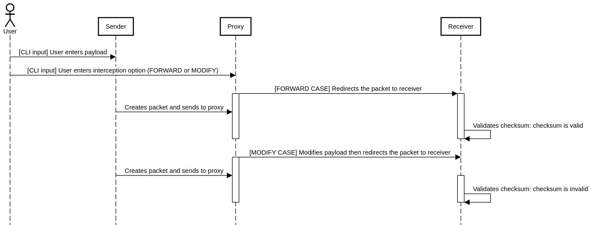

### Task
- Create simple TCP based client-server application.
- Create a proxy application (that is in the middle).
- Application logic:
    - Client sends data to Proxy.
    - Option1: Proxy just forwards it to the server.
    - Option2: Proxy does modifications in payload and resend them to server.

For Option2: Server must figure out that data has been changed in the middle (calculating packet checksum).
### Sequence diagram of implementation


### Run application
1. Build with cmake 
```shell
cmake CMakeLists.txt
```
2. Build application with make
```shell
make
```
3. Run (sudo usage is mandatory since raw sockets require root privileges)
```shell
sudo ./packets_checker
```
